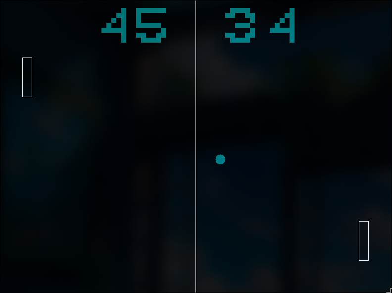

# pong-assembly

Creating a Pong clone with assembly. linux 64bit

## Requirements:

- nasm
- gcc

## File Structure:

```
.
├── asm
│   ├── bitmaps.asm         - Bitmap data for game elements.
│   ├── graphics_utils.inc  - Macros for drawing shapes with colors.
│   ├── main.asm            - Main game logic and loop.
│   ├── string_utils.asm    - String printing utilities.
│   ├── utils.asm           - General utility functions.
│   ├── x11lib_wrapper.asm  - Wrapper functions for X11 library calls.
│   └── XK_keycodes.inc     - Keycode definitions for keyboard input.
├── example.png
├── makefile
└── README.md
```

## Example


